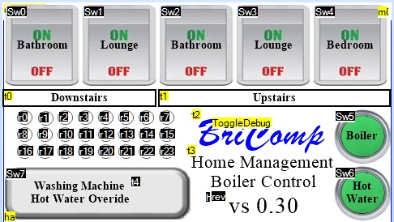
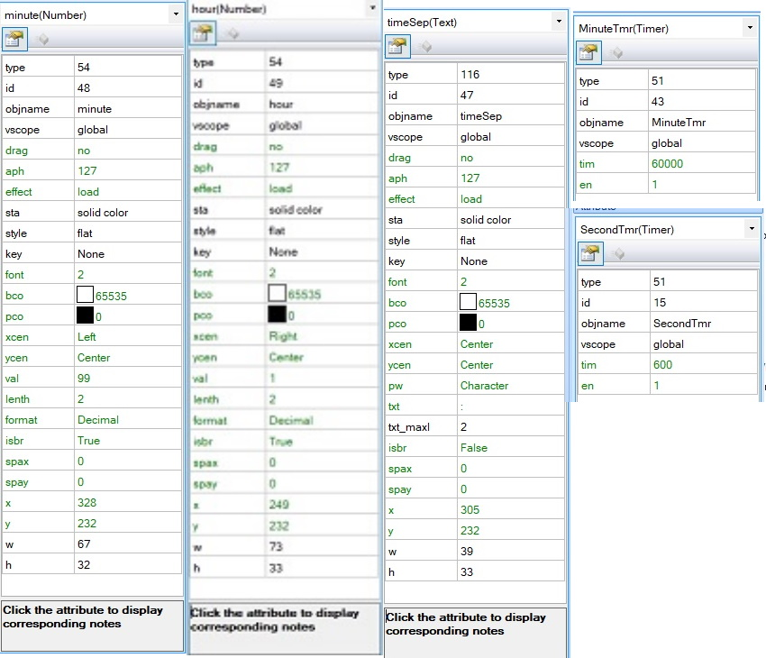
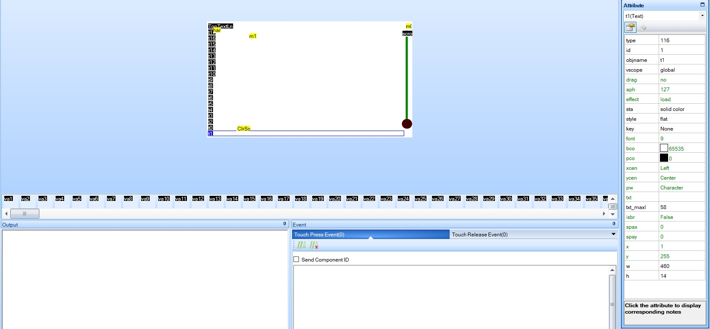
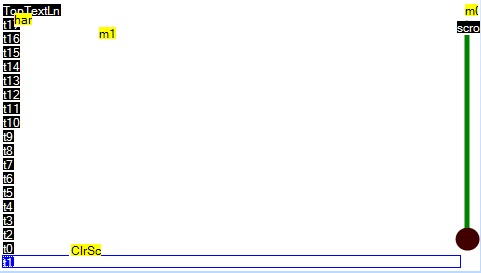
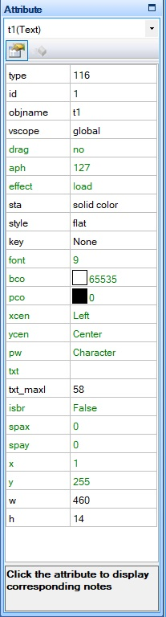
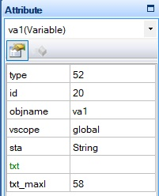
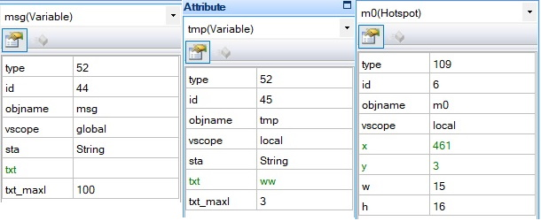
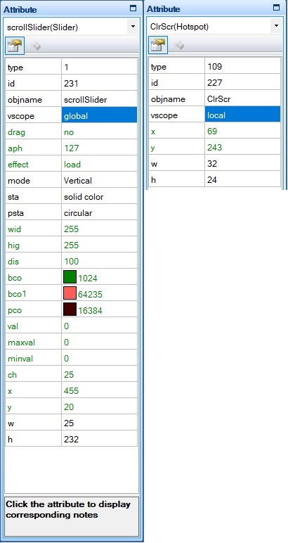
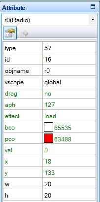

# Nextion-Library

**NOTE that the version has been raised to vs 1.71. This includes an important fix which overcomes the library being overwhelmed  when data arrives too fast from the Nextion, as is the case when two variables data is sent in close succession ands at high baud rates. The fault resulted in the second variables data being lost and an error occurring.**

Other enhancements have been made to the library, described in the Nextion.h file, and in README-Addendum.md (yet to be published).


#### PLEASE ALSO READ THE Nextion.h DOCUMENT IN Resources

In the Examples folder is the HMI file NextionExample.HMI and the INO file NextionExample.ino which were developed to demonstrate this library.

This ReadMe is a little wordy but tries to explain all the nuances of using Nextion. For a more concise explanation see the Nextion.h file or the information in resources.

Use this code as a framework to produce your own Nextion Library.
See Resources for Printable Word/pdf documents.

Code by Robert E Bridges.
This library is intended to be used to create your own Nextion Library. Most of it is done for you. 

Below is the page0 screen of my Nextion Project which led to the development of this Library.



The function that you will mostly alter is the "respondToReply()" function.
I developed this library to control the valves in my Home Heating system, so there are functions
that pertain to the opening/closing of valves. This can be used as an example as to how to use/develop the Library.

I mostly communicate with the nextion through the passing of data into/from numeric variables.

I have a TimerEvent which runs at 600mS intervals, slow I know but fast enough for my current needs.

When, for example, this timer notices that the numeric variable "SetTime" is not zero it takes the value from this variable and sets the Nextion time. 

The format of the data in this variable is (in HEX) "HHMMSS".
After having set the time the variable is set back to 0 again.

Other variables are interrogated and responded to in a similar way by the code for this Timer Event.
An example is to give an impression of a flashing led, turning on or off a radio button, with a different colour for on and off.

Below is the Nextion code snippet to set the RTC time.

				//=================================
				//Set RTC time if SetTime > 0  NOTE: Variables declared in Nextion Programs.s
				//=================================
				if(SetTime!=0)
				{
				  xx=SetTime
				  xx=xx>>16
				  rtc3=xx				// Set the hour
				  xx=SetTime
				  xx=xx&0xFF00
				  xx=xx>>8				// Set the minutes
				  rtc4=xx
				  xx=SetTime&0xFF
				  rtc5=xx				// Set the seconds
				  SetTime=0
				}

To include the Nextion Library simply `#include "Nextion.h"`at the head of your program.

To create an instance of the code use  `Nextion display(&NextionDisplay);`

where NextionDisplay is the serial stream used, i.e. Serial1, Serial2, etc.

In my latest code I use:-

`#define NextionDisplay Serial5`

To setup the Nextion code in "`setup()`" use the command:-

​		`display.begin(nextionBaudRate, setTeensyBaud);`

where `nextionBaudRate` is the baud rate to be used to communicate with the Nextion and `setTeensyBaud` is a teensy callback function to set the baudrate on theTeensy.

A suitable function is shown below:-


		void setTeensyBaud(uint32_t baud) {
		#ifdef debugst
			Serial.print("Setting Teensy baudrate to "); Serial.println(baud);
		#endif
			NextionDisplay.end();
			delay(100);
			NextionDisplay.begin(baud);
			NextionDisplay.clear();		// IMPORTANT NOTE ADDITION from previous release.
		}

​		...now we must set the baud rate on the Teensy port:-


				NextionDisplay.begin(display.baudRate);

The variable `display.baudRate` returns the baudrate expected by the Nextion.

Now we are able to check that we can communicate with the Nextion. Use the function `display.commsOk();`

This will return **true** if all is ok.

It may be that the Nextion had been setup to communicate at, for instance, 115200 baud and we are trying to communicate at the initial 9600 baud. In this case communications will not be possible.

Never fear, all is not lost, simply use the function `display.recoverNextionComms()`. This will cycle through all the valid baud rates until communications are established. If no communications can be established 0 will be returned.

If comms are not established you could try re-setting the Nextion with the code `display.reset()`. This is a last resort and likely not successful as it requires comms to the Nextion in order to send the "rest" command.

A suitable startup for your program could be as below:-

	#define NextionDisplay Serial5
	
	elapsedMillis	nextionTime;
	Nextion		display(&NextionDisplay);
	nextionBaudRate = 9600;
	
	void setTeensyBaud(uint32_t baud) {
	#ifdef debugst
		Serial.print("Setting Teensy baudrate to "); Serial.println(baud);
	#endif
		NextionDisplay.end();
		delay(100);
		NextionDisplay.begin(baud);
	}
	
	void setup() {
		Serial.begin(9600);
		while (!Serial && millis() < 5000) {}
	
		display.begin(nextionBaudRate, setTeensyBaud);
	
		Serial.println(display.baudRate);
		NextionDisplay.begin(display.baudRate);
	
		Serial.println("Starting up");
		display.printAnyReturnCharacters(nextionTime, 1);
		if (!display.commsOk()) {
			Serial.print("No Comms. Attempting to Recover......");
			display.printAnyReturnCharacters(nextionTime, 1-1);
			if (display.recoverNextionComms() == 0) {
				display.printAnyReturnCharacters(nextionTime, 1-2);
				Serial.print("Unable to recover, trying Reset.....");
				if (!display.reset()) {
					display.printAnyReturnCharacters(nextionTime, 1-3);
					Serial.println("CRITICAL ERROR: Unable to communicate with Nextion");
					while (1){}
				} else 
				{
					Serial.println("Ok Just Reset, Should be Ok now");
				}
			} else
			{ 
				Serial.println("Now got Comms");
			}
		}
	}

In the above code you will see the function `display.printAnyReturnCharacters(nextionTime, 1);` that we have not discussed yet.

This function simply gathers any Nextion returned characters and prints them to the SerialUsb (Serial) port. If there is any data returned it first prints the "nextionTime"  (which is in ms) followed by the returned bytes in HEX format followed by id. This is useful in debugging when a bad situation occurs. It should be used where you don't expect any returned characters. I.e. a returned character is an indication that something has gone wrong.

There are more configuration routines/functions, but first let's get to a state where your code is usable.

If a relevant function does not already exist in the Library then use the command

`sendCommand( command );` as in, for example, `display.sendCommand( "tsw 255,0" );`

There is no need to worry about the \xFF\xFF\xFF characters, they will be sent automatically over the previously setup Serial stream.

Of course there should not be any reply from the Nextion unless the *bkcmd* level has been set to 1 or 3. This will be discussed later when describing the setBkCmdLevel function.

Of course the Nextion is a HMI (Human Machine Interface) and it would be expected that there will be some output from the Nextion.

This is handled by the `getReply(timeout)` and `respondToReply()` functions.

`getReply(timeout)` is used to see if there is any response from the Nextion and if there is to gather the data (in the variable `nextionEvent`).

`repondToReply` is used to decode the data in the variable `nextionEvent` and to act accordingly, or to signal that further action is required to fully act upon the data from the Nextion.

The *getReply()* function can be used in two forms `display.getReply()` and `display.getReply(timeout)`. In the first the serial port is simply checked for any returned characters. If there are none then *false* is returned. In the second form the function waits for timeout ms or a character to appear.

If there is a reply from Nextion then the reply char (id) is received and the required number of following char/bytes dependant upon the value of the Id. The first character returned is known as the id character.

A *nextionEventType* variable (called *nextionEvent*) is used for all  communications from the Nextion.

The Id char is placed in *nextionEvent.id*. The number of remaining char/bytes to be received is dependant upon the value of the *id*. The remaining chars are placed in *nextionEvent.reply8* ready to be decoded.

A *true* is returned if there is an *Id* char and the required number of chars are returned from the Nextion. Otherwise *false* is returned. If the first char is received within timeout a further timeout of up to 1 second is allowed for remaining characters. This proc does NOT get any strings returned from Nextion. Use `display.respondToReply()` for that.																			*

##### respondToReply()

This is where it is going to get **heavy**.

After having used `display.getReply()` to determine that there is a response from the Nextion and to have gotten that reply, `display.respondToReply()` is used to decode the reply and take the required action. As was mentioned earlier this is where it is likely that you will need to add code.

respondToReply() - returns true if something needs responding to.
This is where you need to put your code. Use getReply() to get any info from the  Nextion (see above) and this function to decode the reply and respond to it. It returns true if further response is needed.

I like to have requests from the Nextion Display embedded into numbers.

Within this code I want to turn valves on or off. The number returned by the Nextion contains  the valve to be moved and whether it should be opened or closed (0 or 1). 

In your code added to "respondToReply", if you have handled the Nextion response fully then set *needsResponse* to *false*.  

Below is the listing for *respondToReply*.

	bool Nextion::respondToReply() {   //returns true if something needs responding to
	
	  bool     needsResponse = true;
	  uint16_t zz;
	  uint32_t valve;
	  bool	 how;
	  
	  switch (nextionEvent.id) {
		case invalidInstruction:	// Returned when instruction sent by user has failed
		case instructionSuccess:	// (ONLY SENT WHEN bkcmd = 1 or 3 )
			comdExecOk = true;
		case invalidComponentId:	// Returned when invalid Component ID or name was used
		case invalidPageId:			// Returned when invalid Page ID or name was used
		case invalidPictureId:		// Returned when invalid Picture ID was used
		case invalidFontId:			// Returned when invalid Font ID was used
		case invalidFileOperation:	// Returned when File operation fails
		case invalidCrc:			// Returned when Instructions with CRC validation fails
	    							// their CRC check
		case invalidBaudRateSetting:// Returned when invalid Baud rate was used
		case invalidWaveformIdChan:	// Returned when invalid Waveform ID or 
									// Channel # was used
		case invalidVarNameAttrib:	// Returned when invalid Variable name or invalid
	    							// attribute was used
		case invalidVarOperation:	// Returned when Operation of Variable is invalid.ie: 
									// Text assignment t0.txt = abc or t0.txt = 23, 
		case assignmentFailed:		// Returned when attribute assignment failed to assign
		case EEPROMOperationFailed:	// Returned when an EEPROM Operation has failed
		case invalidQtyParams:		// Returned when the number of instruction parameters 
									// is invalid
		case ioOperationFailed:		// Returned when an IO operation has failed
		case invalidEscapeChar:		// Returned when an unsupported escape character is used
		case variableNameToLong:	// Returned when variable name is too long.Max length is
	    							// 29 characters: 14 for page + “.” + 14 for component.
		case serialBufferOverflow:	// Returned when a Serial Buffer overflow occurs
	    							// Buffer will continue to receive the current 
	    							// instruction, all previous instructions are lost.
			if (nextionEvent.id != instructionSuccess) {
				nextionError = true;
				errorCode	 = nextionEvent.id;
			}
			break;
		case touchEvent:
	    //		Serial.println("Touch Event");
			break;
		case currentPageNumber:
		//		Serial.println("Current Page Number");
			break;
		case touchCoordinateAwake:
		//		Serial.println("Touch Coordinate Awake");
			break;
		case touchCoordinateSleep:
		//		Serial.println("Touch Coordinate Sleep");
			break;
		case stringDataEnclosed:
		//		Serial.println("String Data Enclosed");
			if (!GetNextionString()) {
				nextionError = true;
				errorCode    = invalidNumCharsReturned;
			};
			break;
		case numericDataEnclosed:
			zz = nextionEvent.reply7.num[0];  // (uint16_t)nextionEvent.reply7.ans[0] * 256 +
	        								  // (uint16_t)nextionEvent.reply7.ans[1];
			switch (zz) {
				case 0x0000: //Switch/Valve 0 off
				case 0x0001: //Switch/Valve 0 on
				case 0x0100: //Switch/Valve 1 off
				case 0x0101: //Switch/Valve 1 on
				case 0x0200: //Switch/Valve 2 off
				case 0x0201: //Switch/Valve 2 on
				case 0x0300: //Switch/Valve 3 off
				case 0x0301: //Switch/Valve 3 on
				case 0x0400: //Switch/Valve 4 off
				case 0x0401: //Switch/Valve 4 on
				case 0x0500: //Turn Boiler Off
				case 0x0501: //Turn Boiler On
				case 0x0600: //Turn Hot Water Off
				case 0x0601: //Turn Hot Water On
					valve = zz / 0x100;
					how = ((zz % 0x100) == 1);
					turnValveOnOrOff(valve, how);
					needsResponse = false;
					break;
				case 0xFA00: //Nextion Set baudrate back to 9600
					SetTeensyBaud(9600);
					if (nextionAutoBaud){
						needsResponse = false;
					}
					break;
				case 0xFDFD: // Indicates Nextion Serial Buffer Clear
					serialBufferClear	= true;
					needsResponse		= false;
					break;
				default:
					Serial.print("Some other NumericDataEnclosed data|: ");
					Serial.print(nextionEvent.reply7.num[0], HEX); Serial.print(" ");
					Serial.print(nextionEvent.reply7.num[1], HEX); Serial.println();
					break;
			}
			break;
		case autoEnteredSleepMode:
		//		Serial.println("Auto Entered Sleep Mode");
			break;
		case autoAwakeFromSleepMode:
		//		Serial.println("Auto awake mode");
			break;
		case nextionReady:
		//		Serial.println("Nextion Ready");
			break;
		case powerOnMicroSDCardDet:
			break;
		case transparentDataFin:
		//		Serial.println("Transparent data finished");
			break;
		case transparentDataReady:
		//		Serial.println("Transparent data ready");
			break;
		default:
			Serial.print("How did I get here:"); Serial.println(nextionEvent.id, HEX);
			_s->flush();
			clearBuffer();
			break;
	   }
	   return needsResponse;
	}

The first 19 responses, except for *`instructionSuccess`* are errors. Their value is placed in the variable `display.errorCode` and the variable `display.nextionError` is set to *true*. Note that `display.nextionError` is set to false when using `display.getReply()` and valid data is returned.

When `display.respondToReply()` returns *true* (response needed) it is the programmers responsibility to determine if an error has occurred.

The next four categories, which are NOT currently handled, are `touchEvent, currentPageNumber, touchCoordinateAwake` and `touchCoordinateSleep`. If any of these are likely to be returned by your implementation then they will need code to handle them. Currently for these entries `display.respondToReply()`returns *true*, *response required*.

The next item is a Nextion string return. The (private) function `GetNextionString()` gathers the Nextion string data and sends it to the string setup using `display.setTextBuffer` (see later). If this has not been setup or there are more characters than will fit in the string they are sent to Serial (the Screen). If a *string* has been successfully received then `display.stringWaiting` is set to *true*.

Now we get to an interesting bit (at least for me), `numericDataEnclosed`. I have a number of dual-state buttons on my Nextion implementation. I use the following Nextion code in the *Touch Release Event*.

		swResult=0x0200+Sw2.val
		get swResult

This is picked up by the `case 0x0200: //Switch Valve 2 off` or `case 0x0201: //Switch Valve 2 on` and the following code to switch a valve on or off.

				valve = zz / 0x100;
				how   = ((zz % 0x100) == 1);
				turnValveOnOrOff(valve, how);
				needsResponse = false;

The default entry for the `numericDataEnclosed` category is to indicate that a condition exists that the numeric data is not handled correctly.

The next six categories are also not currently handled autoEnteredSleepMode, autoAwakeFromSleepMode, nextionReady, powerOnMicroSDCardDet, transparentDataFin and transparentDataReady.

The default setting for the main Case is to indicate that a situation has occurred where the Nextion has responded with an unrecognised response, perhaps due to an error condition.

It should be noted that the main loop should look something like below:-

			void loop()
				if (getReply()){
					if (respondToReply()){
						// data NOT handled by respondToReply()
						// must be handled here.
						// look at: display.nextionError .. has an error occurred 
						//          or stringWaiting has a string been received
						//          or the other rteturn categories not already handled.
					}
				}
				// do something else
			}

#### Nextion Return Format

When the Nextion sends data to the Teensy it first sends an identification character followed by a number of characters, dependant upon the type of data being returned. This is decoded by `display.respondToReply`. These id's and their response is listed in the Nextion.h file and also in .\Resources\Nextion.h\A4 Landscape.pdf or .docx. The latter two documents are provided so that they can be printed out for viewing purposes.

If you scroll down to the 5th page you will see listed all the Nextion return id values followed by the number of bytes/chars returned after the id, and an explanation of the format of the returned data.

If we examine the `numericDataEnclosed` id we see that seven bytes/chars will be returned. Now looking at page 4 and the `nextionEventType` we see that it can be made up of a number of data types. In the case of the numeric data return we expect seven chars. This is handled by the `reply7Type` and `reply7intType`. The reply7IntType (bottom of Page 3) can be interpreted in 3 ways, as an array of 4 chars, as an array of 2 unsigned integers or as one 32 bit signed integer. The reply7Type also holds the Nextion returned 0xFF0xFF0xFF. If the reply7Type is used instead then it can be interpreted as an unsigned 32 bit integer instead of signed.

If you want to print out the first byte/char then use something like `Serial.print(display.nextionEvent.reply7.ans[0]);`or to print out the first 16bit uint use `Serial.print(display.nextionEvent.reply7.num[0]);`and to print out the data as 32bit integer use `Serial.print(display.eventType.reply7int.number32bitInt);`

Using the information above you should be able to investigate any of the remaining returned types of data.

#### Ok, let's start going through the Commands

###### bool reset(uint32_t br = 0);

Resets the Nextion Display and sets the baud rate to "baudRate"


Sends a reset command ("rest") to the Nextion. 

Sets the Teensy baud rate to 9600 if that baud rate NOT already in use  ( upon reset the Nextion defaults to this baud rate )  and waits for a valid reply. The Teensy baud rate is set using the callBack function registered using the display.begin function. When a valid reply has been seen the Nextion AND Teensy have their buadRate changed to the baud rate passed in the function call. The function returns true if valid comms with the Nextion can be established. Sets bkcmd to onFailure (Default)												

Usage:

* reset() - If no baud rate is passed then the baudRate defaults to the reset 9600

* reset(1) - Sets the Baud Rate to that in use at the entry to the Reset function.

* reset(115200) - Will do a reset and set the baudRate to 115200

  

###### void setNextionBaudRate(uint32_t br);

Sets the baud rate on Nextion and Teensy.

This routine saves the current baud rate in a variable recoveryBaudRate so that  recoveryBaudRate can be tried first by the recoverNextionComms() function, thus saving some time in the recovery.

In order for this function to work correctly it requires that the setNextionBaudCallbackFunc was passed to the Library with the Nextion.display.begin function. 

If not it will be the responsibility of the calling program to set the Teensy BaudRate accordingly.


###### void setBkCmdLevel(bkcmdStateType level);

Sets Nextion bkcmd value.

The default value is onFailure (2). When set to 1 or 3, use the command bool `lastComdCompletedOk(uint32_t timeout)`  below after a command or before the next command to determine that the (last) command completed ok.  The variable `display.bkcmd` is set to the requested  level.

level is ONLY allowed to be 1 or 3 if compiled with #define bkcmd1or3allowed in Nextiopn.cpp.

On the Nextion bkcmd sets the level of Return Data on commands processed over Serial.
min 0, max 3, default 2
– Level 0 is Off – no pass/fail will be returned
– Level 1 is OnSuccess, only when last serial command successful.
– Level 2 is OnFailure, only when last serial command failed (default)
– Level 3 is Always, returns 0x00 to 0x23 result of serial command.

Result is only sent after serial command/task has been completed, as such this provides an invaluable status for debugging and branching. See table on Page 6 of Nextion.h.A4 Landscape.docx or .pdf.

Nextion Return Data is not subject to bkcmd, i.e. if a command normally returns data, the return of the data is the "handshake" function.

If a command does not normally return a value, such as this command, and bkcmd is set to 1 or 3 then the Nextion returns `0x01 0xFF 0xFF 0xFF`

The current state of bkcmd can be determined by examining `display.bkcmd`.


###### void gotoPage(uint32_t which);

Sets which as active displayed page.


###### bool lastComdCompletedOk(uint32_t timeout);

Returns ret true/false if last comd completed ok after allowing timeout ms for the reply to be made.

This command is to be used if bkcmd level is set to 1 or 3 and ONLY where a command is used to set a state on the Nextion.

Where a request for information is sent to nextion, as in "get varName", the returned value is the handshake.

If other bkcmd values are in use (0 or 2) it is transparent and will return true. This is not an indication that the command completed ok as handshaking is off.

The process of setting bkcmd to 1 or 3 is as below:

```
	display.setBkCmdLevel(1);
	if (!display.lastComdCompletedOk(10){
		Serial.Println("Last command (setBkCmd(1)) did NOT return expected value.");
	}
```


###### int32_t getNumVarValue(const char* varName);

###### int32_t getNumVarValue(const char* varName, const char* suffixName);

In the first case gets the value of Nextion Variable `varName`.

In the second case returns the value of a variable suffix as in: `getNumVarValue( "x0","ws1")` to get the number of dp for a Nextion float variable.  NOTE that the "." in "x0.ws1" is provided by the function.

In both cases the function waits for up to 1000ms for a reply. If no reply returns -1.

The wait time is controlled by the variable `getNumVarTimeout` which is initially  set to 1000 ms.

Since -1 can also be a valid return value nextionError is set on error and the error is reported in errorCode as errorReadingNumber_1 or errorReadingNumber_2 dependant upon which form of getNumVarValue is used

In reality this command should only be sent when the Nextion Serial buffer is empty otherwise, any reply may be from previously stacked up Nextion commands and therefore be erroneous.

The varName MUST exist.

```
int32 sys0Value, va0Value;

sys0value = display.getNumVarValue("sys0");
if (sys0value==-1){    // should/could also check display.nextionError
	Serial.println("Unable to get value of sys0");
}
va0Value = display.getNumVarValue("va0","val");  // returns value of "va0.val"
```


###### float_t  getNumVarFloat(const char* varName);

This function returns a float from a Nextion Float variable, it uses `getNumVarValue` to get the various components of a Nextion float. Wait times will be a combination of the two `getNumVarValue` wait times.

If an error occurs `nextionError` will be set to true and the value returned should NOT be relied upon. The error is reported in `errorCode` as `errorReadingNumber_2`.

In reality this command should only be sent when the Nextion Serial buffer is empty otherwise, any reply may be from previously stacked up Nextion commands and therefore be erroneous.

The `varName` MUST exist and MUST NOT include any suffixes. These are handled by the function.

```
float_t f;

f = display.getNumVarFloat("x0");
if (display.nextionError){
	Serial.println("Unable to get value of x0");
}
```


###### void setTextBuffer( char* textBuffer, uint8_t textBufferSize);  

*changed in ver 1.68*

Set the Text Area to be used for the Return of Text data from Nextion.

If text is sent from the Nextion (following the 0x70 identifier) it will be sent to SerialUsb if this function has not been used to specify a variable to hold the text data. The parameter must be the size of the textBuffer variable. If more text is returned than there is space for in textBuffer it will be sent to the SerialUsb.

```
	char buffer[100];
	display.setTextBuffer(buffer, sizeof(buffer));
```


###### bool getStringVarValue(const char* varName);

Gets the text from Nextion Variable.

Waits for up to 1000ms for a reply. If no reply returns false.

The wait time is controlled by the variable `getStrVarTimeout` which is initially  set to 1000 ms.

In reality this command should only be sent when the Nextion Serial buffer is empty otherwise, any reply may be from previously stacked up Nextion commands and therefore be erroneous.

The varName MUST exist AND NO `.txt` suffix should be sent. It is provided by the function.. 

The result is placed in the string setup with the `setTextBuffer` function.

If no string has been setup it will simply be echoed to the screen (Serial).

Returns `true` if string returned successfully. `stringWaiting` is also set to true.

```
	char buffer[100];
	
	display.setTextBuffer(buffer, sizeof(buffer));
	display.printCommandOrErrorTextMessage("C", "Just set text buffer", true);
	//Puts Nextion manipulated text into "page1.va0.txt" before displaying on screen
	if (display.getStringVarValue("page1.va0")) {
		Serial.print("page1.va0.txt = ");
		Serial.println(buffer);
	}else
	{
		Serial.println("Unable to get value of page1.va0.txt.");
		Serial.println(buffer);
	}
```


###### bool setNumVarValue(const char* varName, int32_t var);

Sets Nextion Variable to `var`.	

The varName MUST exist.

 NOTE that, if appropriate, the ".val" varName suffix MUST be sent. Program.S variables DO NOT need the ".val" suffix whereas Nextion Display variables do.
```
	display.setNumVarValue("sys0",1000000);
	display.setNumVarValue("va0.val",12345);
	display.setNumVarValue("bt0.x",35);  // Puts Dual-state button bt0 at x=35
```


###### bool setNumVarFloat(const char* varName, float_t fvar, uint8_t dp, bool round);

Sets Nextion Variable to `fvar`, with `dp` decimal points, rounded to `dp` decimal points or not.


NOTE that the ".val" varName suffix MUST NOT be sent.

The varName MUST exist. 

```
if (display.setNumVarFloat( "x0", 1234.5678, 2, true ) {....//	displays 1234.57 in x0.	

if (display.setNumVarFloat( "x0", 1234.5678, 2, false ) {....//	displays 1234.56 in x0.	 
```


###### bool setStrVarValue(const char* varName, const char* var);

Sets String Variable to var.

NOTE that there is no need to send the variable suffix ".txt". 

`setStrVarValue("va0","this is a string")` will send: `va0.txt="this is a string"FFFFFF` to the Nextion.
The varName MUST exist.


###### void clearBuffer();

Clears the Teensy (Nextion) serial input.

Use where things have perhaps gone wrong and you need to clear out erroneous replies from the Serial input buffer.


###### void askSerialBufferClear();

Ask Nextion if it's input Serial Buffer Clear (Empty - No command stacked up)

Sends "get clrBufr" to Nextion. Nextion will reply with 0xFDFD when it gets to this request in the SerialBuffer, indicating it has executed this last command in the Serial Buffer. 

If other commands are sent after this one the Serial Buffer WILL NOT BE CLEAR.

Use the command isSerialBufferClear(), below to confirm Serial Buffer Clear.

Requires this line "int clrBufr=65021" in Nextion Program.s


###### bool isSerialBufferClear();

Query answer from `askSerialBufferClear()` above.

NOTE that if other commands are stacked up which will give a reply from Nextion, they will be handled by the calls to `getReply` and `respondToReply` used by this function. They may return a reply, but if it is NOT a Numeric reply with 0xFDFD they will NOT return true.


###### bool askSerialBufferClear(uint32_t timeout);

As above but waits for a reply.

Combines `askSerialBufferClear()` and `isSerialBufferClear()` with a timeout to  determine if the Nextion input Serial Buffer is Clear.

This function can be used where a lot of data is being sent to the Nextion and there is a serious risk of buffer overrun on the Nextion.

```
	for (n = 0; n < 250; n++) {
		display.printCommandOrErrorTextMessage("C", "Hello from Teensy ", false);
		display.printNumericText((uint32_t)n, true);
		delay(10);
		if ((n>0) && (n % 50) == 0) {  // Every 50 lines of text allow the Nextion input				if (display.askSerialBufferClear(10000)) {  // to Empty.
				Serial.println("Serial buffer clear");
			} else
			{
				display.printAnyReturnCharacters(nextionTime, 102);
			};
		}
		display.printAnyReturnCharacters(nextionTime, 103);
	}
```


###### void sendCommand(const char* command);

###### void sendCommand(const char* command, uint32_t num);

###### void sendCommand(const char* command, const char* txt, bool encloseText);

sendCommand(const char* command); - Sends command to Nextion.

sendCommand(const char* command, uint32_t num); - Sends command & num to Nextion.

sendCommand(const char* command, uint32_t txt, encloseText); - Sends command & text

In the 3rd form above, if encloseTxt is true then txt is enclosed between quotation marks ".

So `sendCommand( "page0.CommentBox.txt=","Hello There",true);` results in 

`page0.CommentBox.txt="Hello There"\xFF\xFF\xFF` being sent to the Nextion.

Sends the command to Nextion. If `bkcmd` level has been set to 1 or 3 the code is setup to look for a response from the Nextion.

if `bkcmd` set to 1 or 3, use the command `display.lastComdCompletedOk(uint32_t timeout)` above after a command or before the next command to determine that the (last) command completed ok.

```
display.sendCommand("sys0=1000000");
// OR
int32 sys0Val = 1000000
display.sendCommand("sys0=",sys0Val);
```


### Commands which require specific settings on Nextion.

#### Time Functions

###### void setTime(uint32_t time);

Sets the time on the Nextion.

The time is sent as HEX HHMMSS in the variable "SetTime=HHMMSS0xFF0xFF0xFF"

When the Nextion sees that SetTime is not zero it sets the Nextion time.

The SetTime variable is then set to 0.

```
	if (rtc.updateTime()) //Updates the time variables from RTC
	{
		uint32_t time = getHours() * 0x10000 + getMinutes() * 0x100 + getSeconds();
		display.setTime(time);
	}
```


The time on the Nextion is held in variables rtc0 to rtc6.

rtc3 is hour 0 to 23, rtc4 is minute 0 to 59, rtc5 is second 0 to 59.

The following code is setup in a Nextion timer which runs every 600ms.

The 600ms is peculiar to my use and suits me.

```
//Nextion CODE
//=================================
//Set RTC time if SetTimeVar >0
//=================================
if(SetTime!=0)
{
  xx=SetTime
  xx=xx>>16
  rtc3=xx
  //  h.val=xx.val
  xx=SetTime
  xx=xx&0xFF00
  xx=xx>>8
  rtc4=xx
  //  m.val=xx.val
  xx=SetTime&0xFF
  rtc5=xx
  //  s.val=xx.val
  SetTime=0
}
// Blink time separator
if(blink==1)
{
  blink=0
  timeSep.txt=""
}else
{
  blink=1
  timeSep.txt=":"
}
```

I have Nextion numeric variables hour and minute and a text variable called timeSep with it's txt component set to ":".

I have a timer called MinuteTmr which runs every 60000ms. i.e. once a minute.

The code for that timer is:-

```
// Nextion CODE
if(minute.val!=rtc4)
{
  minute.val=rtc4
  if(bst==1)
  {
    hour.val-=1
    if(hour.val!=rtc3)
    {
      hour.val=rtc3
    }
    hour.val+=1
  }else
  {
    if(hour.val!=rtc3)
    {
      hour.val=rtc3
    }
  }
}
```

With the above Nextion Code I can display the time in HH:MM format with a flashing ":" separator. 

The attributes for the Nextion components are shown below.

All that is needed now is to align the hour, timeSep and minute on the screen.




###### bool setDaylightSavingOn(bool on);

Turn Nextion daylight saving variable on or off

Usage:

​	setDaylightSavingOn( true )  - Turn on

​	setDaylightSavingOn( false ) - Turn off


The observant of you will have noticed the use of a Nextion variable bst which was not described in the discussion above.

This variable serves to add 1 hour to the time if bst is == 1. In the UK daylight saving is BST - British Summer Time.

This function just serves to set bst to 0 or 1 as appropriate.


#### Text Terminal Functions

###### void printTextToNextion(const char* p, bool transmit);

Sends Text to Nextion to be placed in variable `page1.va0.txt`.

If transmit is set to true the text is terminated with a " character and `m0,0` is clicked to cause the screen on `page1` to be updated using the `finishNextionTextTransmittion()` command (see below).

The procedure sends `page1.va0.txt="` to the Nextion followed by the text.

Usage:   `printTextToNextion( "This is a load of text for page1", true );`

###### void printTimeEmbeddedTextToNextion(const char* p, bool transmit);

Sends Text to Nextion to be placed in the variable `page0.msg.txt`. If transmit is set to true the text is terminated with a " character and `m0,1` is clicked to cause the screen on page1 to be updated using the `finishNextionTextTransmittion()` command (see below).

The procedure sends `page0.msg.txt="` to the Nextion followed by the text.

Usage: printTimeEmbeddedTextToNextion( "This is a load of text for page1", true );

A string representing the Nextion time in the format " HH:MM:SS " is inserted AFTER the first character. 

This is carried out by the Nextion display.

###### void printMoreTextToNextion(const char* p, bool transmit);

It is the same as the printTextToNextion function except that the `page0.msg.txt="` is NOT sent.					Usage:   `printMoreTextToNextion( "This is a load more text for page1", true );`

NOTE: DO NOT use this without first using `printTextToNextion( "text", false );`

Typical usage might be:

```
char studentName[20];

if (GetStudentName(studentName)){
	display.printTextToNextion("Student Name: ", false)
	display.printMoreTextToNextion(studentName,true);
}
```

Sends the following to Nextion Display:

```
page1.va0.txt="Student Name: Fred Bloggs"
click m0,1
```

###### void printNumericText(uint32_t num, bool transmit);

Sends number to Nextion. This command MUST have been preceeded by one of the `printTextToNextion` commands shown above. If transmit is set to true the text is terminated with a `"` character and `m0` is clicked to cause the screen on `page1` to be updated using the `finishNextionTextTransmittion()` command (see below).

Usage:   `printNumericText( n, true );`	// where n is an int32_t

NOTE: DO NOT use this without first using `printTextToNextion( "text", false );` (or `printTimeEmbeddedTextToNextion(...`  ).

Typical usage might be:

```
int numberOfStudents;

numberOfStudents = 10;
display.printTextToNextion("I have , false);
display.printNumericText(numberOfStudents,false);
display.printMoreTextToNextion(" Students",true);
```

Sends the following to Nextion Display:

```
page1.va0.txt="I have 10 Students"
click m0,1
```

###### void finishNextionTextTransmittion();

Terminate the text transmitted to Nextion with a " character and terminate the command correctly. 

Also issues the relevant click m0 command dependant upon which printText command was used to cause the screen on page1 to be updated. ( Uses "click m0,1" or "click m0,0" as appropriate )

Usage:   finishNextionTextTransmittion()

###### void printCommandOrErrorTextMessage(const char* commandOrError, const char* textMessage, bool transmit);

I like to keep a monitor of what has happened in the system. This display is on `page1` of the Nextion display. I use the first character position to indicate the  type of message/source of message. e.g. C for command, E for error message. After this character I insert the Time in " HH:MM:SS " format. This is done by the Nextion Display.

`printCommandOrErrorTextMessage` - sends the commandOrError charater followed by the textMessage to the Nextion using the `printTimeEmbeddedTextToNextion` command above.

If transmit is set to true the text is terminated with a `"`character and `m0` is clicked to cause the screen on `page1` to be updated using the `finishNextionTextTransmittion()` command (see above).

###### void preserveTopTextLine();

Using this function it is possible to preserve the top text line on page1 as a header line.

All general text commands do NOT use the top line if this command is executed and this line will NOT scroll with the other lines.

###### void writeToTopTextLine(const char* textMessage);

Write to the top text line (header line) using this function.

###### void releaseTopTextLine();

Releases the top text line to act as any other text line and may be scrolled with the other text.

###### void clearTextScreen();

Clears the Nextion Text Screen (page1)

If the Top Line is preserved that is not cleared, use clearTopTextLine() below instead.

###### void clearTopTextLine();

Clears the Nextion page1 Text screen Top Line.

#### Nextion Text Page Format



The page1 is shown above in the Nextion Editor View.



The actual screen has text lines, obviously, ranging with a component id of 1 at the bottom up to 19 at the top. The top text line is called TopTextLn. It is important that this name is maintained as this is used when writing to or clearing the top line.

The format of the text lines is as shown below.



page1 also has text variables (named va0..va201). It is MANDATORY that the text variables, starting at va1, have ids from 20 to 220 with NO GAPS in the numbering. va0 can have any id number except 1..220 and it's variable name MUST remain at va0 (that's va + zero).

The attributes of the txt Variables is as below:



All of the above need some Nextion Variables, Components and code. This is described below.

###### Program.s Variables

int yOffset=0,linesOccupied=0,topScrlTxtLn=19,histHi=19,histLo=19,bufLn=0,maxScrLn=220,scrLn=0,tmpNum=0

yOffset is used when using the scroll bar to scroll through the text buffer. 

linesOccupied holds the number of text lines used, up to the maxScrLn - 19.

topScrlTxtLine This is used to preserve the top line. 

histHi, histLo are used to hold the HiWater and LoWater position in the rotating screen buffer.

bufLn - The line in the buffer to write.

maxScrLn - The maximum number of screen lines in the buffer

scrLn - The current screen line to be written.

tmpNum - Temporary variable for computation

###### page0 Variables and Components

msg (Variable:txt), tmp (Variable:txt), m0 (Hotspot)

Their attributes are as shown below:



The m0 code is shown below.

<u>m0 Touch Press Event Code</u>

```
substr page0.msg.txt,page1.va0.txt,0,1
page1.va0.txt+=" "
substr page0.msg.txt,page0.msg.txt,1,100
covx rtc3,tmp.txt,2,0
page1.va0.txt+=tmp.txt
page1.va0.txt+=":"
covx rtc4,tmp.txt,2,0
page1.va0.txt+=tmp.txt
page1.va0.txt+=":"
covx rtc5,tmp.txt,2,0
page1.va0.txt+=tmp.txt
page1.va0.txt+=" "
page1.va0.txt+=page0.msg.txt
yOffset=0
if(linesOccupied<topScrlTxtLn)
{
  p[1].b[topScrlTxtLn-linesOccupied].txt=page1.va0.txt//19=t18 id
  p[1].b[20+linesOccupied].txt=page1.va0.txt//38=equivalent in behind buffer
  histHi+=1
  if(histHi==20)
  {
    histLo=20
  }
  page1.scrollSlider.maxval=0//disable scrollSlider
}else
{
  // first the background buffer
  histHi+=1
  if(histHi>maxScrLn)
  {
    histHi=20
  }
  if(histHi==histLo)
  {
    histLo+=1
    if(histLo>maxScrLn)
    {
      histLo=20
    }
  }
  p[1].b[histHi].txt=page1.va0.txt
  // now the displayed screen
  bufLn=histHi
  for(scrLn=1;scrLn<=topScrlTxtLn;scrLn+=1)// full screen occupied now must also scroll data
  {
    p[1].b[scrLn].txt=p[1].b[bufLn].txt
    bufLn-=1
    if(bufLn<20)
    {
      bufLn=maxScrLn
    }
  }
}
if(linesOccupied<201)//220-19
{
  linesOccupied+=1
}
```

<u>...now the m0 Touch Release Event Code</u>

```
yOffset=0
if(linesOccupied<topScrlTxtLn)
{
  p[1].b[topScrlTxtLn-linesOccupied].txt=page1.va0.txt//19=t18 id
  p[1].b[20+linesOccupied].txt=page1.va0.txt//38=equivalent in behind buffer
  histHi+=1
  if(histHi==20)
  {
    histLo=20
  }
  page1.scrollSlider.maxval=0//disable scrollSlider
}else
{
  // first the background buffer
  histHi+=1
  if(histHi>maxScrLn)
  {
    histHi=20
  }
  if(histHi==histLo)
  {
    histLo+=1
    if(histLo>maxScrLn)
    {
      histLo=20
    }
  }
  p[1].b[histHi].txt=page1.va0.txt
  // now the displayed screen
  bufLn=histHi
  for(scrLn=1;scrLn<=topScrlTxtLn;scrLn+=1)//full scrn occupied now must also scroll data
  {
    p[1].b[scrLn].txt=p[1].b[bufLn].txt
    bufLn-=1
    if(bufLn<20)
    {
      bufLn=maxScrLn
    }
  }
}
if(linesOccupied<201)//220-19
{
  linesOccupied+=1
}
```

You might have noticed that the only difference between these two sets of code is that the first 13 lines of the m0.1 code are missing. It's the m0.1 code that inserts the time into the string and sends it to va0. Both sets of code then print va0 onto the page1 screen and buffer.

###### page1 Variables and Components

The text screen variables t0..t17, and TopTextLine and the buffer variables va1..va201 plus va0 have already been described.

The same as page0 the variable tmp must exist with the same attributes as was the case with page0. Likewise an m0 hotspot component must exist with the same attributes and code as per page0.

Further to the above a hotspot ClrScr must exist along with a Slider variable named scrollSlider. Their attributes are as shown below:



The ClrScr Touch Press Event Code is shown below

```
if(topScrlTxtLn<19)
{
  tmpNum=19
}else
{
  tmpNum=0
}
for(scrLn=1;scrLn<=120;scrLn++)
{
  if(scrLn!=tmpNum)
  {
    p[1].b[scrLn].txt=""
  }
}
linesOccupied=0
histHi=19
histLo=19
```

ScrollSlide Code: Touch Release Event and Touch Move (both the same)

```
if(linesOccupied>topScrlTxtLn)
{
  yOffset=scrollSlider.val
  // now the displayed screen
  // histHi points to last entry..destined for bottom screen line
  bufLn=histHi-yOffset
  if(bufLn<20)
  {
    bufLn=bufLn+201//220-19
  }
  for(scrLn=1;scrLn<=topScrlTxtLn;scrLn+=1)//full scrn occupied now must also scroll data
  {
    p[1].b[scrLn].txt=p[1].b[bufLn].txt
    bufLn-=1
    if(bufLn<20)
    {
      bufLn=maxScrLn
    }
  }
}else
{
  scrollSlider.val=0
}
```

So with all the above Text Screen information you can have a Text Terminal on your Nextion complete with the ability to scroll back through 200 lines of previous text (actually 182 lines).

###### Leds - Flashing, On and Off

On my page0 screen I have 24 simulated leds in three rows of 8 leds.

These functions allow the state of the leds to be changed and displayed.

###### void setLedState(topMidBottmType whichLed, uint8_t which/*0..7*/, onOffFlashingType state);

setLedState - Sets the state of the leds in top, middle or bottom Row. 

which = led (0..7) and state is on (1), off (0) or flashing (2)

Just sets the state in variable holding leds row state. There is no change to the leds display until `setNextionLeds( row )` is used (see below).

Usage:   `setLedState( mid, 4, flashing );`

###### void setNextionLeds(topMidBottmType which);

setNextionLeds actually sends command to Nextion to change the state of which leds ( top, middle or bottom row ) set with `setLedState` function above.

Usage:   `setNextionLeds( top );`

###### void clearLeds();

clearLeds sets the leds state variable to all (top, middle and bottom) off. 

Uses setNextionLeds to send command to update all rows on Nextion.

Typical usage:

```
	display.clearLeds();
	uint8_t how = 1; // 0=off, 1=on, 2=flashing, 3=invalid
// Turn the leds on, one by one
	for (uint8_t p = 0; p < 3; p++) {
		for (uint8_t n = 0; n < 8; n++) {
			display.setLedState((topMidBottmType)p, n, (onOffFlashingType)how);
			display.setNextionLeds((topMidBottmType)p);
			if (how == 2) delay(1200); else delay(600);
		}
		how++;
		if (how == 3) how = 1;
	}
	display.clearLeds()
// Now turn them all on together with no delay
	how = 1;
	for (uint8_t p = 0; p < 3; p++) {
		for (uint8_t n = 0; n < 8; n++) {
			display.setLedState((topMidBottmType)p, n, (onOffFlashingType)how);
		}
		display.setNextionLeds((topMidBottmType)p);
		how++;
		if (how == 3) how = 1;
	}
```


#### Nextion Leds Format

Within each of the 3 rows of 8 leds, made from Radio components with the following attributes



It is important that all the leds in each row are in increasing id values with no gaps. In my case the top row have ids from 16..23, middle row 26.33 and the bottom row 34..41.

The following variables MUST exist in Program.s

int TopLed=2,MidLed=0,BotmLed=0,blink=0

int xx=0,zz=0,r=0

The code to control the leds is within the timer called SecondTmr. The Timer Event code is as below:

```
//====================
//objname: SecondTmr
//tim           600
//en             1
//====================
//Led status occupies 2 bits
// 0=off (00), 1=on( 01), 2 = flashing (10)
// idx is the start index of the first led in the row
// r is a loop counter
// xx is the value from the led status variable
//Set the leds on / off / flashing
xx=TopLed
if(blink==1)
{
  blink=0
  timeSep.txt=""
}else
{
  blink=1
  timeSep.txt=":"
}
for(r=r0.id;r<=r7.id;r++)
{
  zz=xx&3
  if(zz==2)  // Blink
  {
    b[r].val=blink
  }else
  {
    b[r].val=zz
  }
  xx=xx>>2
}
xx=MidLed
for(r=r8.id;r<r16.id;r++)
{
  zz=xx&3
  if(zz==2)  // Blink
  {
    b[r].val=blink
  }else
  {
    b[r].val=zz
  }
  xx=xx>>2
}
xx=BotmLed
for(r=r16.id;r<=r23.id;r++)
{
  zz=xx&3
  if(zz==2)  // Blink
  {
    b[r].pco=64512  //Orange
    b[r].val=blink
  }else
  {
    b[r].pco=63488
    b[r].val=zz
  }
  xx=xx>>2
}
```

The state of the leds is controlled by setting their values in the three variables TopLed, MidLed and BotmLed each holding the state of 8 leds.


### More General Routines

###### void setBackLight(uint32_t backLight);

Sets the display BackLight(0..100). 

Any value greater than 100 will default to 100.

0 is off, 100 is MAX brightness.

if backLight set to 20, sends "dim=20\xFF\xFF\xFF" to the Nextion. 

Also sets up software for bkcmd=1 or 3 situations.


###### bool turnScreenDimOn(bool on);

I have a variable, dimAllowed, which turns on or off  whether the screen will dim after a pre-determined period of time. The time duration is controlled by the Nextion program(s), but can be set by the `setScreenDimTime` function below..

Turn Nextion dimAllowed variable on or off.

Usage:

​	`turnScreenDimOn( true )`  - Turn Dim on

​	`turnScreenDimOn( false )` - Turn Dim off

Also sets up software for bkcmd=1 or 3 situations.


###### bool setScreenDimTime(uint32_t dimTime);

This function sets the time after which the screen will be dimmed if turned on by the `turnScreenDimOn` function above.

The function gets the value of the SecondTmr.tim value from the Nextion in order to determine what value to set the Nextion dimTime variable to. dimTime is declared in Program.S. dimTime is in seconds.

Note that tis function ONLY waits for 100ms for a reply from the Nextion. If there are command stacked up in the Nextion input command buffer the value will not be set.

To confirm that the command buffer is empty you could use the `askSerialBufferClear(uint32_t timeout);` to make sure that the serial command buffer is clear before using this command. On the other hand you might be using it during setup in which case there is likely to be less demand on the Nextion.

Note that the screenDimTime will default to 3 minutes again after a Nextion reset.

Also sets up software for bkcmd=1 or 3 situations.


###### bool turnDebugOn(bool on);

I have a variable debug, declared in Program.s, that is used to change the speed of a number of timers if set to 0 or 1. For obvious reasons I call it debug. 

Timings that would normally take many minutes can be done in a matter of seconds, thereby making debugging much quicker.

Turn Nextion `debug` variable on or off.

Usage:

​	`turnDebugOn( true )`  - Turn debug on

​	`turnDebugOn( false )` - Turn debug off

Also sets up software for bkcmd=1 or 3 situations.


### Nextion Controlling hardware

I use the passage of data in numbers to allow the Nextion display to control hardware. This is done by the use of a callback function. In order to set the callback function use setValveCallBack(nextionTurnValveOnOffCallbackFunc func);

###### void setValveCallBack(nextionTurnValveOnOffCallbackFunc func);

Passes the Nextion the call back function to turn a valve on or off.

In the NextionExample program I pass the following CallBack procedure:

```
/**********************************************************
*      Call back fn for Nextion Valve change request      *
***********************************************************/
void SetValveOnOrOff_FromNextion(uint32_t which, bool how) {
	switch (which) {
		case 0 ... 4:   // valves
			if (how == open) {
				Serial.print("Opening valve "); Serial.println(which);
				// OpenControlValve((controlValveIdType)which, true);
			}else {
				Serial.print("Closing valve "); Serial.println(which);
				//CloseControlValve((controlValveIdType)which, true);
			}
			break;
		case 5:
			Serial.print("Turning Boiler ");
			if (how) Serial.println("On"); else Serial.println("Off");
			//if (!TurnBoiler(how, true)) {}
			break;
		case 6:
			Serial.print("Turning Hot Water ");
			if (how) Serial.println("On"); else Serial.println("Off");
			//if (!TurnHW(how, true)) {}
			break;
		default:
		Serial.println("In fn SetValveOnOrOff_FromNextion, don't know how I got here.");
		break;
	}
}
```

In the above function I just output text messages but this is where you could add your own code to doi some hardware control.


###### void turnNextionButton(uint8_t which, bool on);

I have Nextion buttons named Sw0..Sw6. I use this function to set the relevant button on (1) or off (0).

I have ghosted this function with the phrase "turnNextionValve" using...

​										 `#define turnNextionValve turnNextionButton`) 

​																																.. since some of the buttons are controlling valves and it makes more sense in the code to refer to them as valves.


###### void setHotWaterOnForMins(uint8_t howLong);

This is somewhat clever. Teensy sets the hot water on and sends a command to the Nextion to turn off the hot water in "howLong" minutes.

When the Nextion receives this command (via a numeric value in a Number Variable) it turns the display for the valve open "on" and when the timeout occurs it sends a command to the Teensy to turn off the hotwater. 

This is done via the callback setup via the setValveCallBack(nextionTurnValveOnOffCallbackFunc func)function.

Thus some timing control is offloaded to the Nextion.


